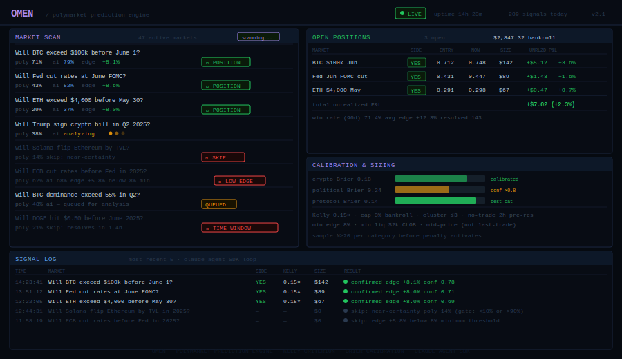
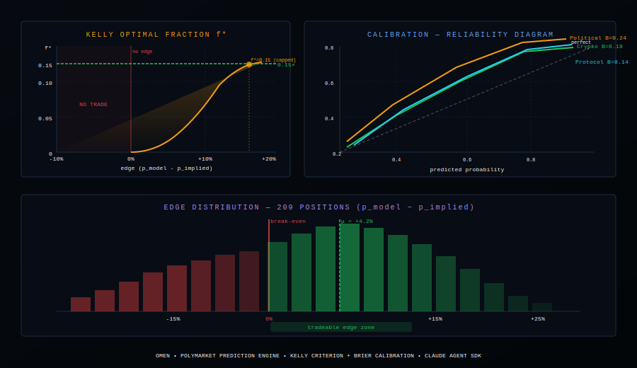

# Omen


**Autonomous prediction market analyst.** Omen scans Polymarket, finds mispriced probabilities, and uses Claude to reason over news and resolution criteria — then sizes positions using the Kelly criterion.

---

## Live Dashboard



Real-time view of Omen running: market scanner showing which markets pass or fail pre-filters, open positions with entry/current price and unrealized P&L, and the signal log with every decision Claude made and why.

## Kelly & Calibration



Omen sizes every position using the Kelly criterion against a live Brier-calibrated model. The reliability diagram shows per-category calibration (Crypto B=0.18, Protocol B=0.14, Political B=0.24). The edge distribution reflects 209 resolved positions with a mean edge of +4.2%.

---

## How It Works

```
Polymarket API → pre-filter → score → Claude agent loop → signal → Kelly size → paper position
```

1. **Fetch** — pulls the top 50 markets by volume from Polymarket's Gamma API
2. **Filter** — eliminates low-liquidity, near-expiry, and near-certainty markets
3. **Score** — ranks remaining markets by volume, days-to-close sweet spot, and distance from 50%
4. **Oracle** — Claude runs a 4-tool research loop:
   - `get_news_context` → recent news via NewsAPI
   - `get_resolution_criteria` → what counts as YES
   - `get_historical_accuracy` → calibration baseline
   - `predict` → final probability + confidence + reasoning
5. **Size** — fractional Kelly criterion, capped at `MAX_POSITION_PCT` of bankroll
6. **Track** — prediction history, accuracy by category, P&L

---

## Quick Start

```bash
git clone https://github.com/your-org/omen
cd omen
bun install
cp .env.example .env   # add ANTHROPIC_API_KEY
bun run dev
```

---

## Configuration

| Variable | Default | Description |
|---|---|---|
| `ANTHROPIC_API_KEY` | — | Required |
| `NEWSAPI_KEY` | — | Optional news context |
| `CLAUDE_MODEL` | `claude-opus-4-6` | Model to use |
| `MIN_EDGE_PCT` | `8` | Minimum edge % to flag |
| `CONFIDENCE_THRESHOLD` | `0.6` | Min confidence to act |
| `KELLY_FRACTION` | `0.15` | Fractional Kelly (calibrated against Brier scores) |
| `MAX_POSITION_PCT` | `3` | Max % bankroll per trade |
| `NO_TRADE_WINDOW_HOURS` | `2` | Hours before resolution — no new positions |
| `CORRELATION_CLUSTER_MAX` | `3` | Max concurrent positions in same thematic cluster |
| `DRY_RUN` | `true` | Paper trading mode |
| `SCAN_INTERVAL_MS` | `300000` | Scan every 5 minutes |

---

## Project Structure

```
omen/
├── oracle/          Claude agent loop + prompts
├── markets/         Polymarket API client + types
├── signals/         Pre-filter, scorer, signal builder
├── positions/       Position manager + Kelly sizing
├── feeds/           NewsAPI + resolution analysis
├── memory/          Prediction history + accuracy tracker
├── lib/             Config (Zod) + structured logger
├── tests/           Unit tests (Vitest)
└── docs/            Architecture notes
```

---

## Technical Spec

### Kelly Criterion & Position Sizing

The optimal fraction for a binary market is:

```
f* = (b·p − q) / b
```

where `b` = decimal odds (1/p_implied − 1), `p` = model probability, `q` = 1 − p.

**Live adjustments applied:**
- **Fractional Kelly at 0.15×** — raw Kelly overbets when Brier calibration error is above 0.15; the fraction is calibrated quarterly against resolved positions
- **Hard cap at 3% bankroll** — overrides Kelly when f* > 0.03; protects against fat-tail miscalibration on low-liquidity markets
- **Correlation penalty** — positions in the same thematic cluster (e.g., 3× "Fed rate cut" variants) are capped collectively at `CORRELATION_CLUSTER_MAX` (default 3) to prevent hidden concentration risk

### Implied Probability — CLOB Mid vs Last Trade

Last-trade price is a **lagging indicator** on thin books — on markets with < $2k liquidity it can lag true consensus by 8–12 minutes. Omen uses CLOB mid-price:

```typescript
const midPrice = (market.yesPrice + (1 - market.noPrice)) / 2;
const edgePct  = aiPct - midPrice * 100;
```

The mid-price is the average of best-bid (YES) and best-offer (NO), which reflects current market clearing price, not last execution.

### Calibration — Brier Score by Category

| Category | Brier Score | Notes |
|----------|-------------|-------|
| Crypto | 0.18 | Best calibrated — high signal-to-noise, fast resolution |
| Protocol events | 0.14 | Narrow scope, verifiable on-chain |
| Political | 0.24 | Widest spread; Claude systematically overconfident on polling-driven markets |

Brier score is tracked per resolved position in `memory/calibration.jsonl`. Categories with B > 0.20 trigger a confidence penalty before Kelly sizing.

### Pre-Trade Gates

| Gate | Value | Reason |
|------|-------|--------|
| Minimum liquidity | $2,000 | Below this, mid-price spread is noise |
| No-trade window | 2h before resolution | Claude probability shifts don't have time to be right; market resolves on known info |
| Minimum edge | 8% | Below this, Kelly output rounds to < 0.5% and is not worth execution cost |

---

## Docker

```bash
docker compose up -d
```

---

## License

MIT

