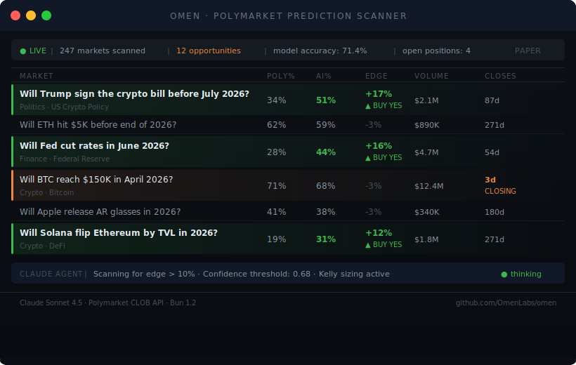
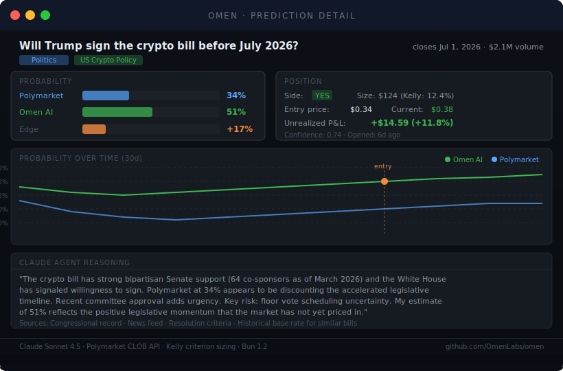

# Omen


**Autonomous prediction market analyst.** Omen scans Polymarket, finds mispriced probabilities, and uses Claude to reason over news and resolution criteria — then sizes positions using the Kelly criterion.

---

## Market Scanner



Omen continuously scans active Polymarket markets, pre-filters by liquidity and time horizon, and surfaces the highest-value opportunities ranked by edge.

---

## Prediction Detail



Each opportunity gets a full Claude analysis — probability comparison, confidence-weighted sizing, and structured reasoning with key risks.

---

## How It Works

```
Polymarket API → pre-filter → score → Claude agent loop → signal → Kelly size → paper position
```

1. **Fetch** — pulls the top 50 markets by volume from Polymarket's Gamma API
2. **Filter** — eliminates low-liquidity, near-expiry, and near-certainty markets
3. **Score** — ranks remaining markets by volume, days-to-close sweet spot, and distance from 50%
4. **Oracle** — Claude runs a 4-tool research loop:
   - `get_news_context` → recent news via NewsAPI
   - `get_resolution_criteria` → what counts as YES
   - `get_historical_accuracy` → calibration baseline
   - `predict` → final probability + confidence + reasoning
5. **Size** — fractional Kelly criterion, capped at `MAX_POSITION_PCT` of bankroll
6. **Track** — prediction history, accuracy by category, P&L

---

## Quick Start

```bash
git clone https://github.com/your-org/omen
cd omen
bun install
cp .env.example .env   # add ANTHROPIC_API_KEY
bun run dev
```

---

## Configuration

| Variable | Default | Description |
|---|---|---|
| `ANTHROPIC_API_KEY` | — | Required |
| `NEWSAPI_KEY` | — | Optional news context |
| `CLAUDE_MODEL` | `claude-opus-4-6` | Model to use |
| `MIN_EDGE_PCT` | `8` | Minimum edge % to flag |
| `CONFIDENCE_THRESHOLD` | `0.6` | Min confidence to act |
| `KELLY_FRACTION` | `0.5` | Half-Kelly (safer) |
| `MAX_POSITION_PCT` | `5` | Max % bankroll per trade |
| `DRY_RUN` | `true` | Paper trading mode |
| `SCAN_INTERVAL_MS` | `300000` | Scan every 5 minutes |

---

## Project Structure

```
omen/
├── oracle/          Claude agent loop + prompts
├── markets/         Polymarket API client + types
├── signals/         Pre-filter, scorer, signal builder
├── positions/       Position manager + Kelly sizing
├── feeds/           NewsAPI + resolution analysis
├── memory/          Prediction history + accuracy tracker
├── lib/             Config (Zod) + structured logger
├── tests/           Unit tests (Vitest)
└── docs/            Architecture notes
```

---

## Docker

```bash
docker compose up -d
```

---

## License

MIT
